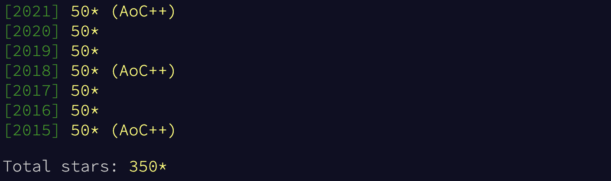

# advent of code

### python only branch

In **2015** I focused primarily on learning the quirks of python.
Most of the code there are oneliners, sometimes even readable ones.

Readability was the goal of **2016**.
Achieved or not, that's for the reader to decide!

**2017**, the year of nothing in particular.
[Code](https://github.com/MasterMedo/aoc/blob/master/2017/day/8.py), [code](https://github.com/MasterMedo/aoc/blob/master/2017/day/18.py), [code](https://github.com/MasterMedo/aoc/blob/master/2017/day/22.py)...

If you want to learn something [golfy](https://github.com/MasterMedo/aoc/blob/master/2018/day/5.py) and [quirky](https://github.com/MasterMedo/aoc/blob/master/2018/day/1.py) head over to **2018**.
One liners galore, won't argue about the readability though, yuck.
A cool [solution](https://github.com/MasterMedo/aoc/blob/master/2018/day/8.py) to [day 8](https://adventofcode.com/2018/day/8).

**2019**, most fun year so far?
Maybe because I solved all [intcode puzzles](https://adventofcode.com/2019/day/9) before starting the [mathy one](https://adventofcode.com/2019/day/22)s.

If you're new to programming; **2020** is your jam. Back to the basics year with a bit of number theory.

> disclaimer ---
> There's a lot of switching back and forth between python 2 and 3.
